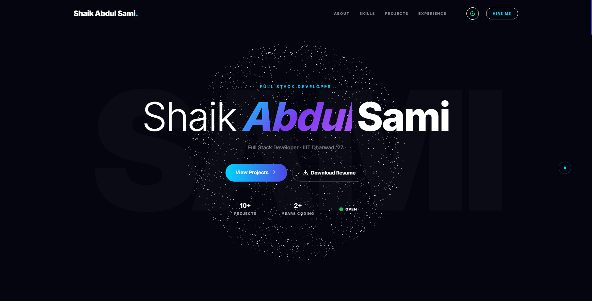
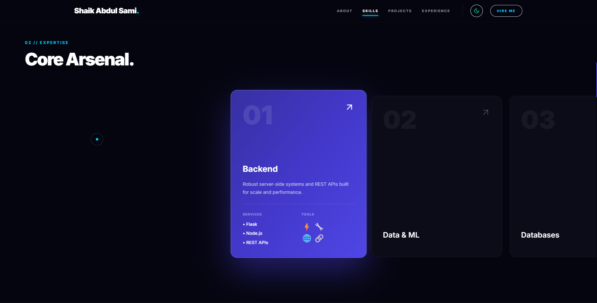
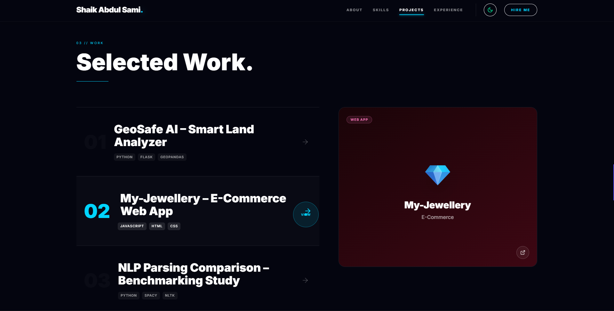
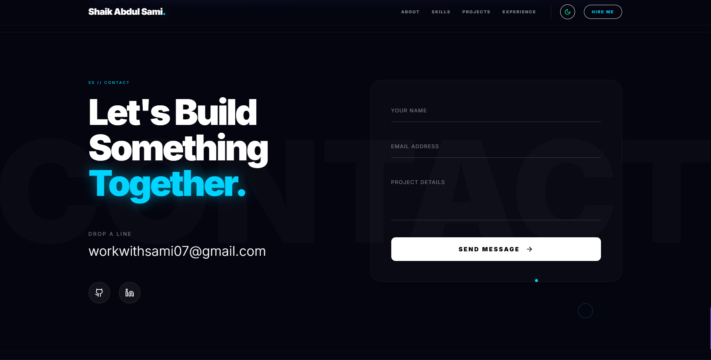
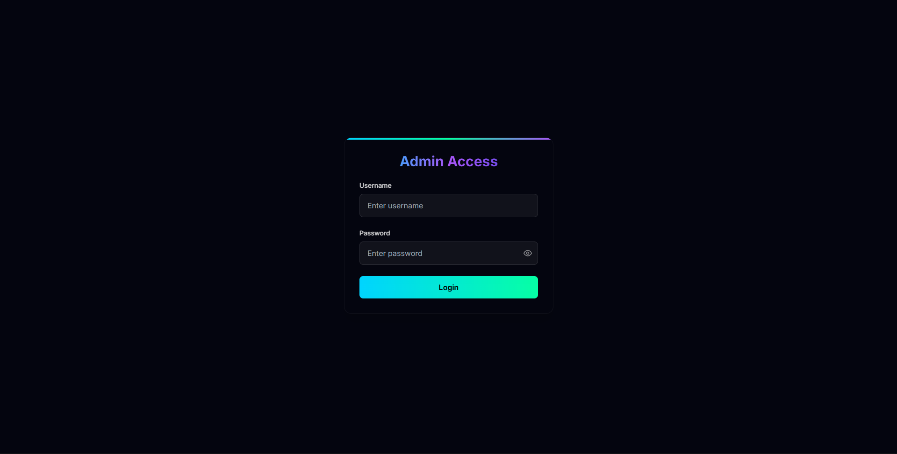
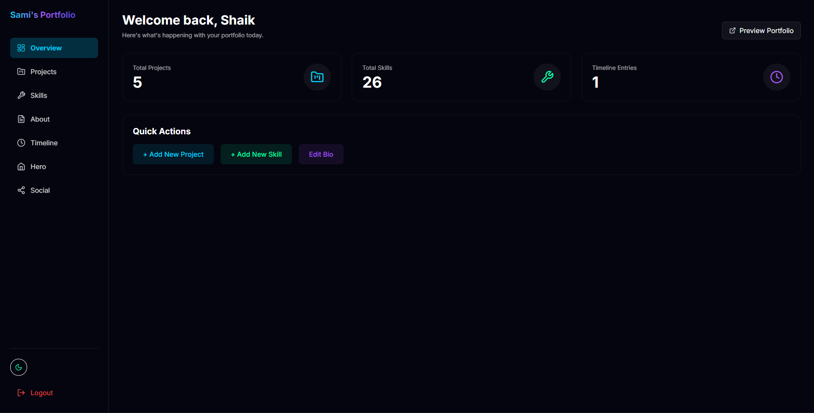
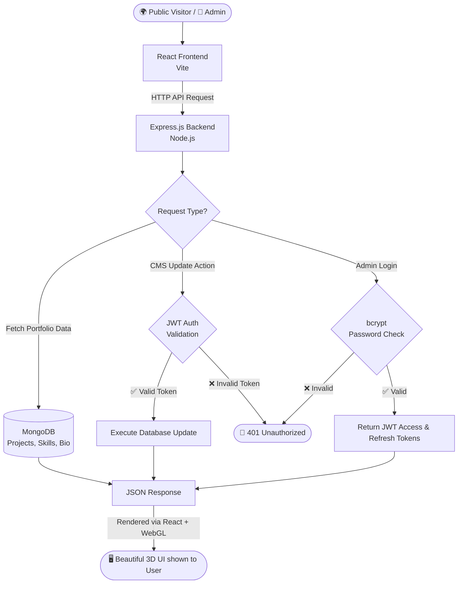

<div align="center">

# ✨ Smart Folio
### *Premium 3D Personal Portfolio & Content Management System*

**A complete, production-grade 3D personal portfolio — mesmerize visitors with cinematic graphics and manage your content via a secure admin dashboard without touching code.**

<br/>

[](#)
[](#)
[](#-tech-stack)
[](#)

</div>

---

## 📸 Screenshots

| 🌌 3D Hero Section | 🚀 Skills Showcase |
| :---: | :---: |
|  |  |
| **📂 Dynamic Projects Panel** | **📬 Contact & Live Clock** |
|  |  |
| **🔐 Secure Admin Login** | **🎛️ CMS Dashboard** |
|  |  |

*(Please ensure you upload these screenshots to an `assets/screenshots/` folder in your GitHub repository!)*

---

## 🤔 What Is This?

Think of this as a **digital business card on steroids**:

- 🌍 **Visitors** get to experience a premium, cinematic 3D website with buttery smooth scrolling, dynamic cursor interactions, and beautiful animations.
- 🔐 **You (the owner)** can log into a hidden dashboard with a password to manage projects, update skills, edit your bio, and view your timeline.
- ☁️ **Everything is dynamic** — no need to redeploy or touch the code when you finish a new project or learn a new skill. Just update it from the dashboard and it instantly reflects on the live site!

---

## ✨ Features

### For Visitors (Public Portfolio)
| Feature | Description |
|---------|-------------|
| 🌌 **3D Particle Sphere** | Mesmerizing, interactive WebGL hero section that reacts to mouse movements |
| 🌊 **Smooth Scrolling** | Studio-grade fluid scrolling powered by Lenis |
| ✨ **Cinematic Animations** | Blur-to-clear entrances and scroll-triggered animations using GSAP |
| 📂 **Interactive Projects** | Sticky preview panels that dynamically update gradient backgrounds and images on hover |
| 🚀 **Horizontal Pin Scroll** | Unique scrolling mechanics for the Skills section with expanding active cards |
| ⏱️ **Live IST Clock** | A ticking, real-time precise clock embedded in the footer |
| 🖱️ **Custom Cursor** | Vanilla JS expanding ring cursor with specific "VIEW" modes for interactive elements |

### For the Owner (Admin Dashboard)
| Feature | Description |
|---------|-------------|
| 🔐 **Secure Login** | Password-protected admin dashboard with encrypted authentication |
| 📦 **Manage Projects** | Easily add, edit, or delete portfolio projects |
| 🛠️ **Update Skills** | Add new technologies, proficiency levels, and categories |
| 📖 **Edit Bio & Timeline** | Keep your journey and experience completely up-to-date |
| ⚡ **Instant Sync** | Changes made in the dashboard instantly update the public-facing portfolio |

### Backend Architecture & Security
| Feature | Description |
|---------|-------------|
| 🔐 **Two-Token JWT Auth** | Stateless, highly secure authentication using Access and HttpOnly Refresh tokens |
| 🛡️ **XSS & CSRF Protection** | Tokens are stored properly in memory and strictly isolated cookies |
| 🔑 **Password Hashing** | Bcrypt with 12 salt rounds ensures maximum database security |
| 🗄️ **MongoDB Database** | Fast, flexible NoSQL schema using Mongoose ORM |

---

## 🧠 System Architecture & Workflow

> Here is how data flows through **Smart Folio** to serve visitors and the administrator.



---

### ⚙️ How It Works — Step by Step

1. **Visitor opens the website** → The React frontend loads, initializing the Three.js particle sphere and GSAP animations.
2. **Data is fetched** → The frontend requests the latest bio, projects, and skills from the Express backend.
3. **Backend queries the database** → Express talks to MongoDB to retrieve all visible data.
4. **Cinematic UI is rendered** → GSAP handles the entrance animations, and Lenis takes over the scroll hijacking to ensure fluid motion.
5. **You (Admin) log in** → You go to `/admin/login`. Your password is verified against the bcrypt hash in the database.
6. **Tokens are issued** → You receive a short-lived Access Token in memory and a secure `HttpOnly` Refresh Token in your browser cookies.
7. **You manage content** → Every time you add a project or edit a skill, the backend verifies your Access Token before making the change in MongoDB.

---

## 🛠️ Tech Stack

| Layer | Technology | Why? |
|-------|-----------|------|
| **Frontend Framework** | React.js (Vite) | Lightning fast HMR and component-based UI |
| **Styling** | Tailwind CSS | Rapid, utility-first custom design system |
| **3D Graphics** | Three.js (Vanilla) | Low-level access for the high-performance particle sphere |
| **Animations** | GSAP | Industry-standard, highly performant scroll animations |
| **Smooth Scroll** | Lenis (@studio-freight) | Buttery smooth, lightweight scroll hijacking |
| **Backend** | Node.js + Express | Fast, JavaScript-native REST API |
| **Database** | MongoDB + Mongoose | Flexible NoSQL document storage perfectly suited for CMS |
| **Auth** | JWT + bcryptjs | Bulletproof, stateless secure authentication |

---

## 📂 Project Structure

```
AI_PORTFOLIO/
│
├── 📁 backend/
│   ├── 📁 controllers/      ← Request handlers & business logic
│   ├── 📁 middlewares/      ← JWT verification & security checks
│   ├── 📁 models/           ← Mongoose schemas (Project, Skill, Admin)
│   ├── 📁 routes/           ← Express API endpoints
│   ├── 📁 scripts/          
│   │   └── seed.js          ← Populates DB with initial admin & demo data
│   ├── server.js            ← Main Express entry point
│   └── .env                 ← Secret keys & DB URI
│
├── 📁 frontend/
│   ├── 📁 src/
│   │   ├── 📁 admin/        ← Protected CMS pages (Dashboard, Login, Forms)
│   │   ├── 📁 context/      ← AuthContext for global login state
│   │   ├── 📁 portfolio/    
│   │   │   ├── components/  ← Navbar, Footer, CustomCursor, Ticker
│   │   │   └── sections/    ← Hero (Three.js), Skills, Projects, About
│   │   ├── App.jsx          ← Main routing & GSAP/Lenis setup
│   │   └── index.css        ← Tailwind & Custom scrollbar overrides
│   │
│   ├── index.html           ← Entry HTML
│   ├── vite.config.js       ← Vite bundler config
│   └── package.json         ← Frontend dependencies
│
└── README.md                ← You are here!
```

---

## 🚀 Getting Started (Local Setup)

> **Prerequisites**: You need [Node.js](https://nodejs.org/) (v18+) and [MongoDB](https://www.mongodb.com/) installed and running locally.

### Step 1 — Clone the Project
```bash
git clone https://github.com/abdulsami-S/smart-folio.git
cd smart-folio
```

### Step 2 — Set Up the Backend
```bash
cd backend
npm install
```

Ensure your `backend/.env` file exists with the following variables:
```env
PORT=5000
MONGO_URI=mongodb://localhost:27017/sami_portfolio
JWT_SECRET=super_secret_jwt_key
REFRESH_SECRET=super_refresh_secret
JWT_EXPIRES_IN=15m
REFRESH_EXPIRES_IN=7d
ADMIN_USERNAME=sami
ADMIN_PASSWORD=sami@admin2027
NODE_ENV=development
CLIENT_URL=http://localhost:5173
```

Seed the database with initial data:
```bash
node scripts/seed.js
```

Start the backend server:
```bash
npm run dev
# API running at http://localhost:5000
```

### Step 3 — Set Up the Frontend
Open a new terminal window:
```bash
cd frontend
npm install
```

Start the frontend development server:
```bash
npm run dev
# Website running at http://localhost:5173
```

---

## 📡 Key API Endpoints

| Method | Endpoint | What it does | Protected |
|--------|----------|--------------|-----------|
| `POST` | `/api/auth/login` | Authenticate admin & generate tokens | ❌ |
| `POST` | `/api/auth/logout` | Clear refresh token cookies | ❌ |
| `GET`  | `/api/portfolio` | Get main bio and social links | ❌ |
| `PUT`  | `/api/portfolio` | Update main bio and social links | ✅ |
| `GET`  | `/api/projects` | Get all visible projects | ❌ |
| `POST` | `/api/projects` | Add a new project | ✅ |
| `GET`  | `/api/skills` | Get all skills | ❌ |
| `POST` | `/api/skills` | Add a new skill | ✅ |
| `GET`  | `/api/timeline` | Get journey/timeline items | ❌ |
| `POST` | `/api/timeline` | Add a new timeline entry | ✅ |

---

## ☁️ Deployment Architecture (Recommended)

| Service | Platform | Purpose |
|---------|----------|---------|
| Frontend | Vercel | Hosts the React/Vite UI with global edge caching |
| Backend | Render / Railway | Hosts the Express.js REST API |
| Database | MongoDB Atlas | Cloud-hosted NoSQL database |

---

## 🧠 What I Learned Building This

- ✅ How to integrate **raw Three.js WebGL** inside a modern React application for cinematic hero sections without performance drops.
- ✅ How to construct robust, high-performance scroll animations using **GSAP** and **Lenis**, bypassing standard CSS limitations.
- ✅ How to build a custom Content Management System (**CMS**) from scratch to completely decouple content from code.
- ✅ How to implement highly secure authentication using **HTTP-only cookies** and a dual-token (Access + Refresh) architecture.
- ✅ How to coordinate complex layout requirements like sticky scrolling panels and horizontal pin-scrolling simultaneously.

---

## 🎯 Purpose

This project was built to elevate my personal brand by showcasing an absolute mastery of modern web technologies. Instead of a standard static website, I aimed to build an agency-quality, full-stack platform that acts as both a visual centerpiece and a functional, scalable application.

---

## 👨‍💻 Author

<div align="center">

**Shaik Abdul Sami**

</div>

---

<div align="center">

## ⭐ If You Like This Project

**Give it a star on GitHub — it really helps!** ⭐

</div>
