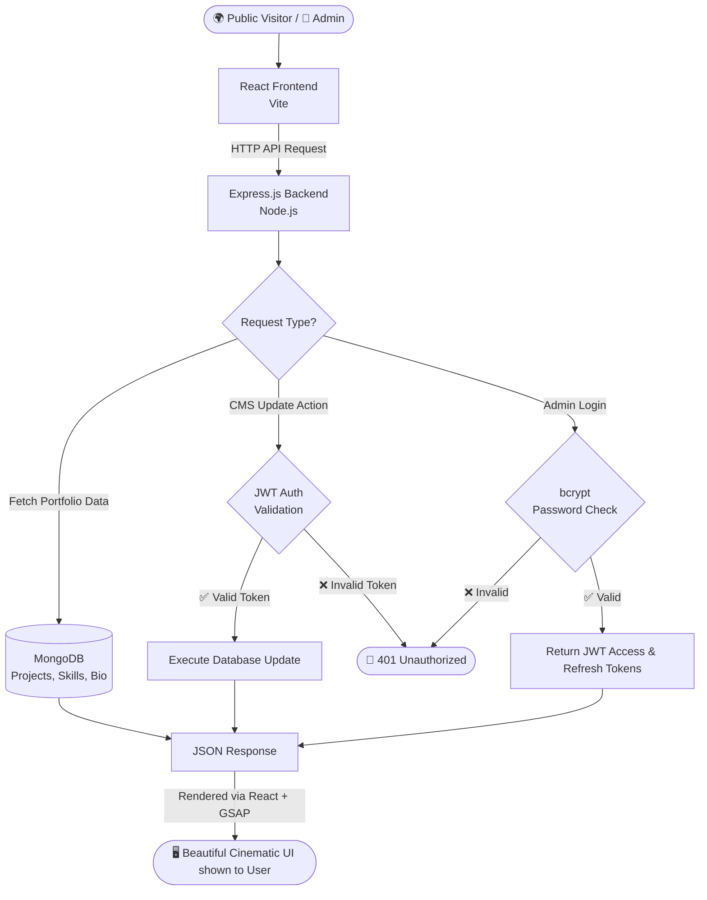

<div align="center">

# ✨ Smart Folio
### *Premium Cinematic Personal Portfolio & Content Management System*

**A complete, production-grade personal portfolio — mesmerize visitors with cinematic animations, interactive particle effects, and an editorial design. Manage your content via a secure admin dashboard without touching code.**

<br/>

[](#)
[](#)
[](#-tech-stack)
[](#)


---

## 📸 Screenshots

<table>
  <tr>
    <td align="center"><b>🌌 Hero Section</b></td>
  </tr>
  <tr>
    <td></td>
    <td></td>
  </tr>
  <tr>
    <td align="center"><b>📂 Dynamic Projects Panel</b></td>
    <td align="center"><b>📬 Contact</b></td>
Small change: added this one-line placeholder to create a commit (2026-05-11).
  </tr>
  <tr>
    <td></td>
    <td></td>
  </tr>
  <tr>
    <td align="center"><b>🔐 Secure Admin Login</b></td>
    <td align="center"><b>🎛️ CMS Dashboard</b></td>
  </tr>
  <tr>
    <td></td>
    <td></td>
  </tr>
</table>


---

## 🤔 What Is This?

Think of this as a **digital business card on steroids**:

- 🌍 **Visitors** get to experience a premium, cinematic website with buttery smooth scrolling, interactive particle effects, dynamic cursor interactions, and beautiful animations.
- 🔐 **You (the owner)** can log into a hidden dashboard with a password to manage projects, update skills, edit your bio, and view your timeline.
- ☁️ **Everything is dynamic** — no need to redeploy or touch the code when you finish a new project or learn a new skill. Just update it from the dashboard and it instantly reflects on the live site!

---

## ✨ Features

### For Visitors (Public Portfolio)
| Feature | Description |
|---------|-------------|
| 🎬 **Cinematic Character Intro** | fromanother.love-inspired cream loader screen: a walking SVG character animates in profile view, a percentage counter counts 0→100%, and a thin progress bar fills — then the screen fades away to reveal the portfolio. |
| 🌌 **Interactive Hero Section** | Parallax ambient orbs, cursor-following spotlight, canvas particle trails, 3D CSS name tilt, and magnetic buttons |
| 🌊 **Smooth Scrolling** | Studio-grade fluid scrolling powered by Lenis |
| ✨ **Cinematic Animations** | Blur-to-clear entrances and scroll-triggered animations using GSAP |
| 📂 **Interactive Projects** | Dynamic project cards with hover effects and gradient backgrounds |
| 🚀 **Horizontal Pin Scroll** | Unique scrolling mechanics for the Skills section with expanding active cards |
| 📢 **Marquee Ticker** | Auto-scrolling ticker strip for additional visual flair |
| 💡 **CTA Banner** | Scroll-animated call-to-action section with glassmorphism styling |
| ⏱️ **Live IST Clock** | A ticking, real-time precise clock embedded in the footer |
| 🖱️ **Custom Cursor** | Glowing dot cursor with particle trail effects on mouse movement |
| 🌗 **Dark / Light Theme** | Full theme toggle with persistent preference stored in localStorage |

### For the Owner (Admin Dashboard)
| Feature | Description |
|---------|-------------|
| 🔐 **Secure Login** | Password-protected admin dashboard with encrypted authentication |
| 📊 **Overview Dashboard** | At-a-glance summary of all portfolio content |
| 📦 **Manage Projects** | Add, edit, delete, reorder, and toggle visibility of portfolio projects |
| 🛠️ **Update Skills** | Add new technologies, proficiency levels, categories, and toggle visibility |
| 📖 **Edit Bio & Timeline** | Keep your journey and experience completely up-to-date with reordering support |
| 🎨 **Hero Editor** | Customize hero section content directly from the dashboard |
| 🔗 **Social Links Editor** | Manage all your social media links in one place |
| ⚡ **Instant Sync** | Changes made in the dashboard instantly update the public-facing portfolio |

### Backend Architecture & Security
| Feature | Description |
|---------|-------------|
| 🔐 **Two-Token JWT Auth** | Stateless, highly secure authentication using Access and HttpOnly Refresh tokens |
| 🛡️ **XSS & CSRF Protection** | Tokens are stored properly in memory and strictly isolated cookies |
| 🔑 **Password Hashing** | Bcrypt with 12 salt rounds ensures maximum database security |
| ⏱️ **Rate Limiting** | Login endpoint is rate-limited to 5 attempts per 15 minutes per IP |
| ✅ **Input Validation** | All POST/PUT endpoints validated with express-validator (type, length, format checks) |
| 🪖 **HTTP Security Headers** | Helmet.js sets 11+ security headers (HSTS, X-Frame-Options, CSP, etc.) |
| 🗄️ **MongoDB Database** | Fast, flexible NoSQL schema using Mongoose ORM |

---

## 🧠 System Architecture & Workflow

> Here is how data flows through **Smart Folio** to serve visitors and the administrator.



---

### ⚙️ How It Works — Step by Step

1. **Visitor opens the website** → A cinematic intro animation plays: a stick-figure character draws itself live via SVG stroke animation, then the name assembles from scattered letters.
2. **Homepage appears** → The React frontend loads with GSAP-powered entrance animations, particle trails, parallax orbs, and smooth scrolling via Lenis.
3. **Data is fetched** → The frontend requests the latest bio, projects, and skills from the Express backend.
4. **Backend queries the database** → Express talks to MongoDB to retrieve all visible data.
5. **Cinematic UI is rendered** → GSAP handles the entrance animations, and Lenis takes over the scroll hijacking to ensure fluid motion.
6. **You (Admin) log in** → You go to `/admin/login`. Your password is verified against the bcrypt hash in the database.
7. **Tokens are issued** → You receive a short-lived Access Token in memory and a secure `HttpOnly` Refresh Token in your browser cookies.
8. **You manage content** → Every time you add a project or edit a skill, the backend verifies your Access Token before making the change in MongoDB.

---

## 🛠️ Tech Stack

| Layer | Technology | Why? |
|-------|-----------|------|
| **Frontend Framework** | React.js (Vite) | Lightning fast HMR and component-based UI |
| **Styling** | Tailwind CSS | Rapid, utility-first custom design system |
| **Animations** | GSAP + SVG Stroke Animation | Industry-standard, highly performant scroll and entrance animations |
| **Particle Effects** | Canvas 2D API | High-performance cursor-following particle trail system |
| **Smooth Scroll** | Lenis (@studio-freight) | Buttery smooth, lightweight scroll hijacking |
| **Icons** | Lucide React | Consistent, lightweight icon library |
| **Input Validation** | express-validator | Server-side validation and sanitization for all API endpoints |
| **Backend** | Node.js + Express | Fast, JavaScript-native REST API |
| **Database** | MongoDB + Mongoose | Flexible NoSQL document storage perfectly suited for CMS |
| **Auth** | JWT + bcryptjs | Bulletproof, stateless secure authentication |
| **Security Headers** | Helmet.js | Automatic HTTP security headers (HSTS, CSP, XSS filter, etc.) |

---

## 📂 Project Structure

```
AI_PORTFOLIO/
│
├── 📁 backend/
│   ├── 📁 config/           ← Database connection & JWT configuration
│   ├── 📁 controllers/      ← Request handlers & business logic
│   ├── 📁 middleware/        ← JWT verification, error handling & rate limiting
│   ├── 📁 models/           ← Mongoose schemas (Admin, Portfolio, Project, Skill, Timeline)
│   ├── 📁 routes/           ← Express API endpoints
│   ├── 📁 scripts/          
│   │   └── seed.js          ← Populates DB with initial admin & demo data
│   ├── server.js            ← Main Express entry point
│   ├── .env                 ← Secret keys & DB URI
│   └── .env.example         ← Example environment configuration
│
├── 📁 frontend/
│   ├── 📁 src/
│   │   ├── 📁 admin/        ← Protected CMS pages (Login, Dashboard, Editors)
│   │   │   └── 📁 pages/   ← Overview, ProjectsManager, SkillsManager,
│   │   │                      TimelineManager, AboutEditor, HeroEditor, SocialEditor
│   │   ├── 📁 api/          ← Axios API service modules
│   │   ├── 📁 context/      ← AuthContext, PortfolioContext, ThemeContext
│   │   ├── 📁 portfolio/    
│   │   │   ├── components/  ← Navbar, Footer, IntroScreen, CustomCursor,
│   │   │   │                  MarqueeTicker, ThemeToggle
│   │   │   ├── sections/    ← Hero, About, Skills, Projects, Timeline,
│   │   │   │                  Contact, CTABanner
│   │   │   └── data/        ← Fallback project data
│   │   ├── App.jsx          ← Main routing & GSAP/Lenis setup
│   │   └── index.css        ← Tailwind, CSS variables & custom scrollbar
│   │
│   ├── index.html           ← Entry HTML with Google Fonts
│   ├── vite.config.js       ← Vite bundler config
│   └── package.json         ← Frontend dependencies
│
└── README.md                ← You are here!
```

---

## 🚀 Getting Started (Local Setup)

> **Prerequisites**: You need [Node.js](https://nodejs.org/) (v18+) and [MongoDB](https://www.mongodb.com/) installed and running locally.

### Step 1 — Clone the Project
```bash
git clone https://github.com/abdulsami-S/smart-folio.git
cd smart-folio
```

### Step 2 — Set Up the Backend
```bash
cd backend
npm install
```

Copy the provided example environment file to create your own `.env` file:
```bash
cp .env.example .env
```
*(Make sure to open `backend/.env` and add your actual MongoDB Atlas URI and generate secure JWT secrets!)*

Seed the database with initial data:
```bash
node scripts/seed.js
```

Start the backend server:
```bash
npm run dev
# API running at http://localhost:5000
```

### Step 3 — Set Up the Frontend
Open a new terminal window:
```bash
cd frontend
npm install
```

Start the frontend development server:
```bash
npm run dev
# Website running at http://localhost:5173
```

---

## 📡 Key API Endpoints

| Method | Endpoint | What it does | Protected |
|--------|----------|--------------|-----------|
| `POST` | `/api/auth/login` | Authenticate admin & generate tokens | ❌ |
| `POST` | `/api/auth/refresh`| Rotate access token via HttpOnly cookie | ❌ |
| `POST` | `/api/auth/logout` | Clear refresh token cookies | ❌ |
| `GET`  | `/api/auth/me`   | Verify session and get admin profile | ✅ |
| `GET`  | `/api/portfolio` | Get main bio and social links | ❌ |
| `PUT`  | `/api/portfolio` | Update main bio and social links | ✅ |
| `GET`  | `/api/projects` | Get all visible projects | ❌ |
| `POST` | `/api/projects` | Add a new project | ✅ |
| `PUT`  | `/api/projects/:id` | Update an existing project | ✅ |
| `DELETE`| `/api/projects/:id` | Delete a project | ✅ |
| `PATCH`| `/api/projects/reorder` | Reorder projects | ✅ |
| `PATCH`| `/api/projects/:id/visibility` | Toggle project visibility | ✅ |
| `GET`  | `/api/skills` | Get all skills | ❌ |
| `POST` | `/api/skills` | Add a new skill | ✅ |
| `PUT`  | `/api/skills/:id` | Update an existing skill | ✅ |
| `DELETE`| `/api/skills/:id` | Delete a skill | ✅ |
| `PATCH`| `/api/skills/:id/visibility` | Toggle skill visibility | ✅ |
| `GET`  | `/api/timeline` | Get journey/timeline items | ❌ |
| `POST` | `/api/timeline` | Add a new timeline entry | ✅ |
| `PUT`  | `/api/timeline/:id` | Update a timeline entry | ✅ |
| `DELETE`| `/api/timeline/:id` | Delete a timeline entry | ✅ |
| `PATCH`| `/api/timeline/reorder` | Reorder timeline entries | ✅ |

---

## ☁️ Deployment Architecture (Recommended)

| Service | Platform | Purpose |
|---------|----------|---------|
| Frontend | Vercel | Hosts the React/Vite UI with global edge caching |
| Backend | Render / Railway | Hosts the Express.js REST API |
| Database | MongoDB Atlas | Cloud-hosted NoSQL database |

---

## 🧠 What I Learned Building This

- ✅ How to build **cinematic SVG stroke animations** with GSAP for premium intro sequences that feel like a luxury brand experience.
- ✅ How to create **interactive particle trail systems** using the Canvas 2D API with performant requestAnimationFrame loops.
- ✅ How to construct robust, high-performance scroll animations using **GSAP** and **Lenis**, bypassing standard CSS limitations.
- ✅ How to build a custom Content Management System (**CMS**) from scratch to completely decouple content from code.
- ✅ How to implement highly secure authentication using **HTTP-only cookies** and a dual-token (Access + Refresh) architecture.
- ✅ How to coordinate complex layout requirements like horizontal pin-scrolling, parallax orbs, and 3D CSS tilt transforms simultaneously.
- ✅ How to design a complete **dark/light theme system** with CSS custom properties and React context.
- ✅ How to build a **fromanother.love-inspired preloader** with a CSS-animated walking figure, GSAP percentage counter, and seamless theme-aware fade transition.

---

## 🎯 Purpose

This project was built to elevate my personal brand by showcasing an absolute mastery of modern web technologies. Instead of a standard static website, I aimed to build an agency-quality, full-stack platform that acts as both a visual centerpiece and a functional, scalable application.

---

## 👨‍💻 Author

<div align="center">

**Shaik Abdul Sami**

</div>

---

<div align="center">

## ⭐ If You Like This Project

**Give it a star on GitHub — it really helps!** ⭐

</div>
