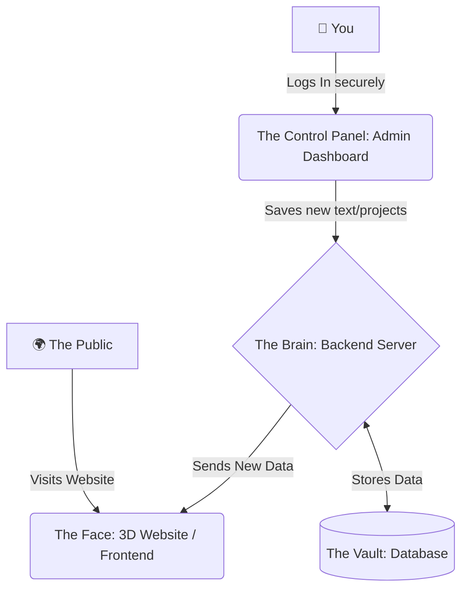

<div align="center">
  
# ✨ Smart Folio — Premium 3D Portfolio & CMS

*A complete, production-grade, full-stack 3D personal portfolio with a secure backend, an admin CMS dashboard, JWT authentication, and modern cinematic 3D web graphics.*

</div>

---

## 🌟 What is this project? (For Everyone)

Imagine having a digital business card, but instead of a boring piece of paper, it's a stunning, interactive 3D universe. 

**Smart Folio** is a premium, cinematic personal website designed to showcase projects, skills, and experience. But it's not just a website—it has a **hidden control panel (Admin Dashboard)**. This means you can update your bio, add new projects, or change your skills just like you would on a social media profile, without ever needing to write or touch code again!

Whether you are a recruiter, a client, or a fellow developer, this portfolio is built to leave a lasting impression.

---

## 🚀 How It Works (The Big Picture Workflow)

To make it easy to understand, think of this project in three parts: **The Face**, **The Brain**, and **The Vault**.



1. **The Face (Public View):** Anyone who visits the site sees a beautiful, cinematic 3D particle sphere, smooth scrolling, and dynamic cards. It asks "The Brain" for your latest information.
2. **The Control Panel (Admin View):** You log into a secure, hidden dashboard. Here, you have easy-to-use forms to edit your portfolio.
3. **The Brain & The Vault (Backend & Database):** When you save changes in the dashboard, The Brain securely locks the new information in The Vault (Database) and instantly updates the public website.

---

## 💎 Premium Features

- **Cinematic 3D Graphics**: A mesmerizing interactive particle sphere that follows your mouse, built with pure mathematics (WebGL).
- **Buttery Smooth Scrolling**: Like gliding on ice, powered by professional studio-grade scroll engines.
- **Live Updating Dashboard**: A hidden CMS (Content Management System) to edit your website on the fly. No coding required to update your resume!
- **Fort Knox Security**: Two-layer token authentication ensures only *you* can edit your portfolio.

---

## 🛠 For the Tech-Savvy: Architecture & Stack

- **Frontend (UI/UX)**: React.js, Vite, Tailwind CSS, Three.js (Raw WebGL), GSAP (Advanced Animations), Lenis (Smooth Scroll).
- **Backend (API)**: Node.js, Express.js.
- **Database**: MongoDB & Mongoose ORM.
- **Security**: JWT (Two-Token Strategy with HttpOnly cookies) + bcryptjs password hashing.

---

## ⚙️ Step-by-Step Setup Guide

Follow these simple steps to get the entire machine running on your computer.

### Step 1: Start The Brain (Backend)
The backend manages the data. It needs to run first.
1. Open your terminal and navigate into the backend folder:
   ```bash
   cd backend
   ```
2. Install the necessary engine parts (dependencies):
   ```bash
   npm install
   ```
3. Load the initial data (your projects and admin account) into the database:
   ```bash
   node scripts/seed.js
   ```
4. Start the engine!
   ```bash
   npm run dev
   ```
*(The backend is now listening quietly on `http://localhost:5000`)*

### Step 2: Start The Face (Frontend)
Open a **new** terminal window (keep the backend running in the old one!).
1. Navigate into the frontend folder:
   ```bash
   cd frontend
   ```
2. Install the visual tools:
   ```bash
   npm install
   ```
3. Launch the website!
   ```bash
   npm run dev
   ```
*(The website is now live and breathing at `http://localhost:5173`)*

---

## 🎮 How to Use Your Control Panel

Want to change the text on your website? Here is how:

1. Go to your secret login page: [http://localhost:5173/admin/login](http://localhost:5173/admin/login)
2. Enter the default credentials:
   - **Username**: `sami`
   - **Password**: `sami@admin2027`
3. You are now inside! Click on the different tabs on the left (Projects, Skills, Timeline) to add, edit, or delete items.
4. As soon as you hit "Save", open the public website in a new tab—your changes will be there instantly.
5. Click **Logout** when you're done to lock the vault.

---

## 📁 Folder Structure Explained

For those who want to explore the files, here is how the house is organized:

```text
AI_PORTFOLIO/
├── backend/          # The Brain (Servers, Databases, Security)
│   ├── models/       # Database blueprints (Defines what a "Project" is)
│   ├── routes/       # The API doors (Where the frontend knocks for data)
│   └── scripts/      # Automation tools (Like the seed script to fill the database)
│
└── frontend/         # The Face (What people see and interact with)
    ├── src/
    │   ├── admin/    # Your secret control panel pages and forms
    │   ├── portfolio/# The beautiful 3D public website components
    │   └── context/  # Memory management (Remembering if you are logged in)
```

---

## 🔒 Security Measures

We take security seriously so your portfolio cannot be hacked or defaced:
- **Access Tokens**: Stored safely in short-term React memory to prevent hackers from stealing them via malicious scripts (XSS).
- **Refresh Tokens**: Locked in an `HttpOnly` cookie that even your own code cannot read, making CSRF attacks nearly impossible.
- **Password Encryption**: We use `bcryptjs` (with 12 salt rounds) to scramble your password so thoroughly that even if the database is ever compromised, your password remains a secret.

---
*Designed with precision. Built for impact.*
