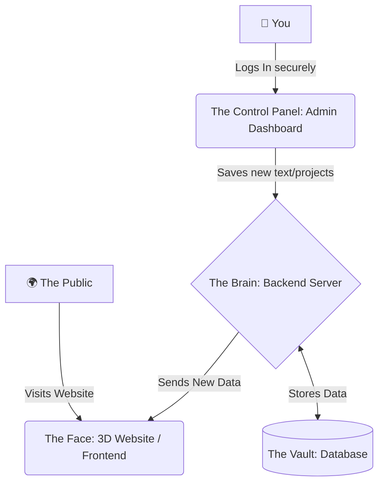

<div align="center">
 ✨ Smart Folio

  <br />
  
  <a href="https://github.com/abdulsami-S">
    
  </a>

  <br />

  <p align="center">
    <em>A complete, production-grade full-stack 3D personal portfolio with a secure backend, an admin CMS dashboard, JWT authentication, and modern cinematic web graphics.</em>
  </p>

  <p align="center">
    
    
    
    
    
  </p>

</div>

---

## 🌟 What is this project? (For Everyone)

> **Imagine having a digital business card, but instead of a boring piece of paper, it's a stunning, interactive 3D universe.**

**Smart Folio** is a premium, cinematic personal website designed to showcase projects, skills, and experience. But it's not just a website—it has a **hidden control panel (Admin Dashboard)**. This means you can update your bio, add new projects, or change your skills just like you would on a social media profile, without ever needing to write or touch code again!

<div align="center">
  <br/>
  
  <br/>
</div>

---

## 🚀 How It Works (The Big Picture Workflow)

To make it easy to understand, think of this project in three parts: **The Face**, **The Brain**, and **The Vault**.

<br />

<div align="center">

| 🌍 The Face (Frontend) | 🧠 The Brain (Backend Server) | 🔒 The Vault (Database) |
| :---: | :---: | :---: |
|  |  |  |
| **The Public View.** Anyone who visits the site sees a beautiful, cinematic 3D particle sphere. | **The Control Center.** When you save changes in the hidden dashboard, the server processes it securely. | **The Storage.** The Brain securely locks the new information in the database. |
| It seamlessly reads data from the brain to instantly show your latest projects and updates. | It mathematically verifies your identity using JWT before allowing any changes. | Instantly pushes updates back to the public website with your new info. |

</div>

<br />



---

## 💎 Premium Features

- 🌌 **Cinematic 3D Graphics**: A mesmerizing interactive particle sphere that follows your mouse, built with pure mathematics (WebGL).
- 🌊 **Buttery Smooth Scrolling**: Like gliding on ice, powered by professional studio-grade scroll engines.
- 🎛️ **Live Updating Dashboard**: A hidden CMS (Content Management System) to edit your website on the fly. No coding required to update your resume!
- 🔐 **Fort Knox Security**: Two-layer token authentication ensures only *you* can edit your portfolio.

---

## ⚙️ Step-by-Step Setup Guide

Follow these simple steps to get the entire machine running on your computer.

### Step 1: Start The Brain (Backend)
The backend manages the data. It needs to run first.

```bash
# 1. Open your terminal and navigate into the backend folder
cd backend

# 2. Install the necessary engine parts
npm install

# 3. Load the initial data (your projects and admin account)
node scripts/seed.js

# 4. Start the engine!
npm run dev
```
*(The backend is now listening quietly on `http://localhost:5000`)*

<br />

### Step 2: Start The Face (Frontend)
Open a **new** terminal window (keep the backend running in the old one!).

```bash
# 1. Navigate into the frontend folder
cd frontend

# 2. Install the visual tools
npm install

# 3. Launch the website!
npm run dev
```
*(The website is now live and breathing at `http://localhost:5173`)*

---

## 🎮 How to Use Your Control Panel

Want to change the text on your website? Here is how:

1. Go to your secret login page: [http://localhost:5173/admin/login](http://localhost:5173/admin/login)
2. Enter your credentials.
3. You are now inside! Click on the different tabs on the left (Projects, Skills, Timeline) to add, edit, or delete items.
4. As soon as you hit "Save", open the public website in a new tab—your changes will be there instantly.
5. Click **Logout** when you're done to lock the vault.

---

## 📁 Folder Structure Explained

For those who want to explore the files, here is how the house is organized:

```text
AI_PORTFOLIO/
├── backend/          # The Brain (Servers, Databases, Security)
│   ├── models/       # Database blueprints (Defines what a "Project" is)
│   ├── routes/       # The API doors (Where the frontend knocks for data)
│   └── scripts/      # Automation tools (Like the seed script to fill the database)
│
└── frontend/         # The Face (What people see and interact with)
    ├── src/
    │   ├── admin/    # Your secret control panel pages and forms
    │   ├── portfolio/# The beautiful 3D public website components
    │   └── context/  # Memory management (Remembering if you are logged in)
```

---

## 🔒 Security Measures

We take security seriously so your portfolio cannot be hacked or defaced:
- **Access Tokens**: Stored safely in short-term React memory to prevent hackers from stealing them via malicious scripts (XSS).
- **Refresh Tokens**: Locked in an `HttpOnly` cookie that even your own code cannot read, making CSRF attacks nearly impossible.
- **Password Encryption**: We use `bcryptjs` (with 12 salt rounds) to scramble your password so thoroughly that even if the database is ever compromised, your password remains a secret.
